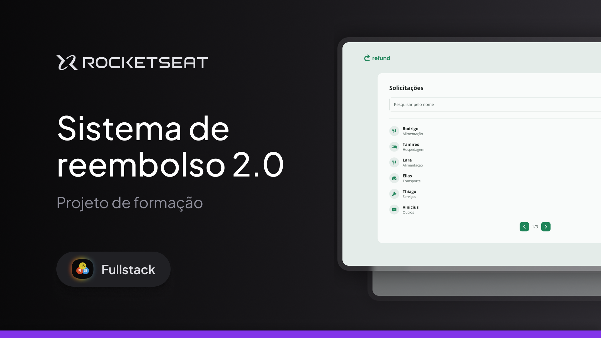

# Refund 2.0 — Sistema de Solicitação de Reembolsos

<p align="center">
  
</p>

<div align="center">


**Aplicação frontend moderna para gestão de reembolsos corporativos com controle baseado em papéis de usuário**

[Figma Design](#-design-figma) • [Funcionalidades](#-funcionalidades) • [Stack](#-stack-tecnológico) • [Guia de Instalação](#-instalação) • [Deploy](#-deploy) • [Contribuição](#-contribuição)

</div>

---

## 📋 Descrição

Sistema web completo para solicitação, acompanhamento e aprovação de reembolsos. Desenvolvido com **React + TypeScript + Vite** e estilizado com **Tailwind CSS**, oferece uma experiência moderna e responsiva.

A aplicação distingue dois tipos de usuários:
- **Employees**: Criam e acompanham solicitações de reembolso
- **Managers**: Revisam, pesquisam e administram as solicitações

---

## 🎨 Design (Figma)

Protótipo e especificações completas no Figma (Dev Mode habilitado):  
👉 [Sistema de reembolso 2.0 - Figma](https://www.figma.com/design/8mY8iCcuuLfSCApuQBAww4/Sistema-de-reembolso-2.0--Community-?node-id=0-1&p=f&m=dev)

---

## ✨ Funcionalidades

### 🔐 Autenticação
- Páginas de **Sign In** e **Sign Up** com validação
- Autenticação por token JWT
- Recuperação automática de sessão ao iniciar
- Persistência segura de credenciais

### 👥 Painel do Employee
- 📋 Criar novas solicitações de reembolso
- 📂 Upload de comprovantes
- 🏷️ Seleção de categoria (Comida, Transporte, Hospedagem, Serviços, Outros)
- 💰 Inserção de valor com formatação
- ✅ Tela de confirmação antes do envio
- 📱 Acompanhamento do status de solicitações

### 📊 Dashboard do Manager
- 🔍 Pesquisa avançada de solicitações por nome
- 📄 **Paginação** de resultados
- 📈 Visualização estruturada com cartões informativos
- 💵 Exibição formatada de valores (moeda)
- 🏷️ Ícones e labels de categoria
- ✏️ Gerenciamento completo de solicitações

### 🎨 Interface & UX
- **Componentes reutilizáveis**: Input, Select, Button (múltiplas variantes), Upload, RefundItem, Pagination, Header
- **Estados visuais**: Loading, disabled, foco visível
- **Utilitários**: formatCurrency, classMerge, categorização automática
- **Design responsivo**: Suporte completo a mobile, tablet e desktop
- **Acessibilidade**: Padrões WCAG implementados

---

## 🧱 Stack Tecnológico

| Categoria | Tecnologias |
|-----------|-------------|
| **Framework** | React 19.1.1, React Router 7.8.0 |
| **Linguagem** | TypeScript 5.8.3 |
| **Build Tool** | Vite 7.1.0 |
| **Estilização** | Tailwind CSS 4.1.11, clsx, tailwind-merge |
| **HTTP Client** | Axios 1.7.0 |
| **Validação** | Zod 4.0.17 |
| **Gerenciamento de Estado** | Context API |
| **Desenvolvimento** | ESLint, TypeScript Compiler |

---

## 📁 Estrutura do Projeto

```
src/
├── components/         # Componentes reutilizáveis
│   ├── AppLayout.tsx
│   ├── AuthLayout.tsx
│   ├── Button.tsx
│   ├── Header.tsx
│   ├── Input.tsx
│   ├── Loading.tsx
│   ├── RefundItem.tsx
│   ├── Select.tsx
│   └── Upload.tsx
├── contexts/          # Context API (Autenticação)
│   └── AuthContext.tsx
├── dtos/              # Type definitions
│   ├── categories.d.ts
│   ├── refund.d.ts
│   └── user.d.ts
├── hooks/             # Custom hooks
│   └── useAuth.tsx
├── pages/             # Páginas da aplicação
│   ├── Confirm.tsx
│   ├── Dashboard.tsx
│   ├── NotFound.tsx
│   ├── Pagination.tsx
│   ├── Refund.tsx
│   ├── SignIn.tsx
│   └── SignUp.tsx
├── routes/            # Configuração de rotas
│   ├── authRoutes.tsx
│   ├── EmployeeRoutes.tsx
│   ├── index.tsx
│   └── ManagerRoutes.tsx
├── services/          # API client
│   └── api.ts
├── utils/             # Funções utilitárias
│   ├── categories.ts
│   ├── classMerge.ts
│   └── formatCurrency.ts
├── App.tsx
├── main.tsx
└── index.css
```

---

## 🚀 Instalação

### Pré-requisitos
- **Node.js**: 18.0.0 ou superior
- **npm**, **yarn** ou **pnpm**

### Passos

1. **Clone o repositório**
   ```bash
   git clone https://github.com/seu-usuario/REFUND_WEB.git
   cd REFUND_WEB
   ```

2. **Instale as dependências**
   ```bash
   npm install
   # ou
   yarn install
   # ou
   pnpm install
   ```

3. **Configure as variáveis de ambiente**
   ```bash
   # Crie um arquivo .env baseado no .env.example
   cp .env.example .env
   ```

4. **Inicie o servidor de desenvolvimento**
   ```bash
   npm run dev
   ```

   A aplicação estará disponível em `http://localhost:5173`

---

## 🔧 Configuração de Variáveis de Ambiente

Crie um arquivo `.env` na raiz do projeto:

```env
# API Configuration
VITE_API_URL=http://localhost:3333
```

**Nota:** Todas as variáveis públicas devem ter o prefixo `VITE_` para serem expostas ao frontend (padrão Vite).

Para **produção/Netlify**, configure as variáveis nas **Build & deploy settings → Environment variables**.

---

## 📦 Scripts Disponíveis

```bash
# Desenvolvimento
npm run dev          # Inicia servidor dev com hot reload

# Build
npm run build        # Build para produção (com type checking)

# Preview
npm run preview      # Preview da build de produção localmente
```

---

## 🌐 Deploy

### Deploy no Netlify

1. **Push seu código para GitHub**
   ```bash
   git add .
   git commit -m "Initial commit"
   git push origin main
   ```

2. **Conecte ao Netlify**
   - Acesse [netlify.com](https://netlify.com)
   - Clique em "New site from Git"
   - Selecione seu repositório
   - Configure as settings:
     - **Build command**: `npm run build`
     - **Publish directory**: `dist`

3. **Configure variáveis de ambiente**
   - Vá para **Site settings → Build & deploy → Environment**
   - Adicione:
     - **Key**: `VITE_API_URL`
     - **Value**: URL da sua API em produção

4. **Deploy automático**
   - Cada push para a branch principal dispara um deploy automático

### Deploy em outras plataformas

- **Vercel**: [Deploy com Vercel](https://vercel.com)
- **GitHub Pages**: Configure como site estático
- **Firebase Hosting**: Hospedagem gratuita do Google

---

## 🏗️ Arquitetura & Padrões

### Autenticação (Context API)
```typescript
// AuthContext fornece user, token e métodos de login/logout
const { user, token, login, logout, isLoading } = useAuth()
```

### Roteamento Protegido
- **AuthRoutes**: Páginas de login/registro (públicas)
- **EmployeeRoutes**: Acesso restrito a employees
- **ManagerRoutes**: Acesso restrito a managers

### Requisições HTTP
```typescript
// api.ts automaticamente inclui token nos headers
// baseURL configurável via VITE_API_URL
export const api = axios.create({ baseURL: import.meta.env.VITE_API_URL })
```

### Type Safety
- Tipos TypeScript para todas as respostas da API
- DTOs em `src/dtos/` com definições de tipos

---

## 🤝 Contribuição

Contribuições são bem-vindas! Para contribuir:

1. **Fork** o repositório
2. **Crie uma branch** para sua feature (`git checkout -b feature/MinhaFeature`)
3. **Commit** suas mudanças (`git commit -m 'Adiciona MinhaFeature'`)
4. **Push** para a branch (`git push origin feature/MinhaFeature`)
5. **Abra um Pull Request**

### Padrões de Código
- Siga o TypeScript strict mode
- Use componentes funcionais e hooks
- Mantenha componentes pequenos e focados
- Adicione comentários em lógica complexa
- Teste antes de fazer PR

---

## 📝 Licença

Este projeto está licenciado sob a Licença MIT - veja o arquivo [LICENSE](LICENSE) para detalhes.

---

## 🙌 Créditos

Desenvolvido com ❤️ usando **React**, **TypeScript** e **Tailwind CSS**.


